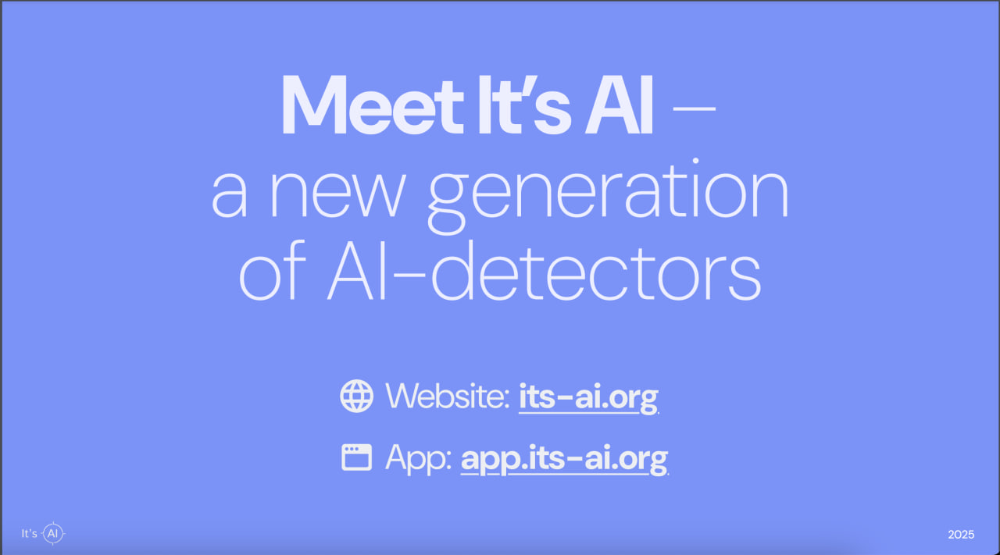
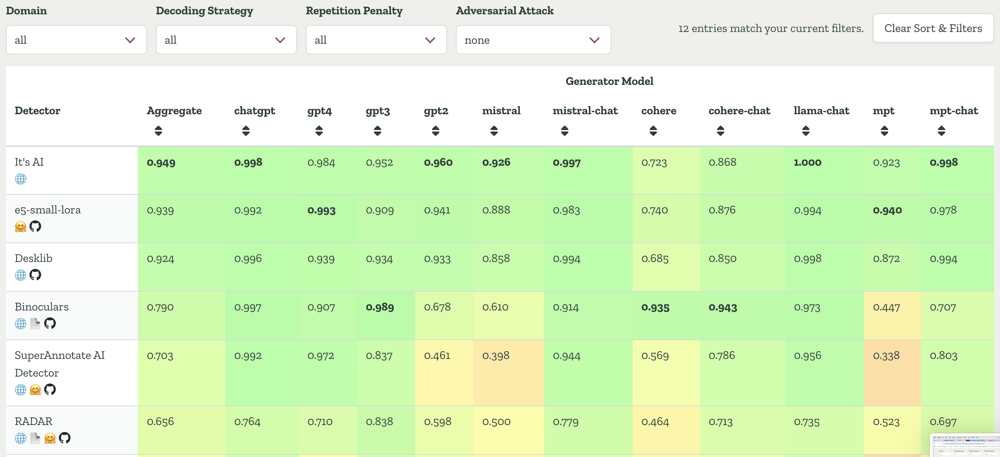

# **Bittensor SN32** <!-- omit in toc -->

 

---

## Decentralized AI Detection <!-- omit in toc -->  

### [🌐 Website](https://its-ai.org/)  
### [⛏️ Mining Docs](docs/mining.md)&nbsp;&nbsp;&nbsp;&nbsp;&nbsp;&nbsp;&nbsp;&nbsp;|&nbsp;&nbsp;&nbsp;&nbsp;&nbsp;&nbsp;&nbsp;&nbsp;[🧑‍🏫 Validating Docs](docs/validating.md) 
### [🤔 FAQ](docs/FAQ.md)&nbsp;&nbsp;&nbsp;&nbsp;&nbsp;&nbsp;&nbsp;&nbsp;&nbsp;&nbsp;&nbsp;&nbsp;&nbsp;&nbsp;&nbsp;&nbsp;|&nbsp;&nbsp;&nbsp;&nbsp;&nbsp;&nbsp;&nbsp;&nbsp;[🎯Incentive mechanism](docs/incentive.md)   

# About

It's AI is an ai-detector tool, which helps people to identify whether the text was human-written or ai-generated. In addition to just classifying texts, It's AI also provides a deep scan functionality, which shows probabilities of AI for each sentence in the text.

While ChatGpt alone has more than 1.8 billion monthly visits, we believe that the ability to accurately determine AI-generated text is really important and will become even more demanded in the future.

## General
* Emission before dTao: 1.77%
* Registered: March 2024
* Website: https://its-ai.org
* Benchmark report: https://its-ai.org/benchmarks.pdf
* Pitch deck: https://its-ai.org/pitchdeck.pdf

## Key Highlights (TL;DR)
Here is a key highlights of It's AI, which will be fully covered further:
1) Most accurate ai-detector in the world according to RAID benchmark (ACL paper 2024)
2) More than just a subnet. Recently we've opened an ITSAI TECHNOLOGIES - FZCO, our legal entity in Dubai, which will help us to grow and process payments outside of bittensor.
3) Constantly improving. We've already developed website, web app, chrome extension, API, britishiser and aren't going to stop on them. Try It's AI by yourself at https://its-ai.org.
4) High market potential. More than 3 billion dollars in market size in just English-speaking countries and we're going right for it. The real-world demand is evident, as demonstrated by our competitors: GptZero (50m$ valuation), CopyLeaks (4m$ last year revenue), ZeroGpt (10m monthly visits) and others.
5) Incentive mechanism. Time and benchmarks proven validation process that makes miners work in the right direction. Thanks to it we've become a new state-of-the-art solution on all three considered academia-known benchmarks.

*RAID leaderboard results*

## Key Highlights (Full)
### Most accurate ai-detector
On the RAID benchmark (ACL paper 2024, the biggest and most robust benchmark up to date) we achieved 94.9% accuracy at 5% FPR and became the most accurate ai-detector, outperforming even commercial detectors like GPTZero, Winston, Originality etc.

We also scored It's AI on GRiD and CUDRT datasets and became №1 solution on them as well.

You can find the full benchmarks report here: https://its-ai.org/benchmarks.pdf

### ITSAI TECHNOLOGIES - FZCO
In the end of Jan 2025 we set up ITSAI TECHNOLOGIES - our company in Dubai.

We see It’s AI to be much more than just a subnet on bittensor and it’s a really big step in SN32 history on our way to 100m$+ valuation, which I believe is quite possible on the 5-year timeframe. By our measurements, the potential market size for our ai-detector is more than 3 billion dollars in just English-speaking countries and we’re going right for it. 

Setting up the company is only the first step and we still have a lot to accomplish, but I am really glad to see how we’ve grown from just an idea of the subnet and two devs to the company in Dubai and a whole team working on It’s AI and I am pretty sure it’s only a beginning.

### Our Apps
Don't judge us by what we say, judge us by what we've done. Here is the list of things that we've already developed:
* Website (http://its-ai.org)
* App (http://app.its-ai.org). Try full experience in our app
* Chrome Extension (https://chromewebstore.google.com/detail/its-ai/lbjiajoblhodlkfloiphigkcemdonidn). Check your text instantly without leaving a page - just highlight it and get an answer
* Britishizer. Today up to 80% of all LLMs (including ChatGPT) write answers in American English. Rewrite them into British English in one click
* API. Integrate It’s AI in your services with our API

### Business part and market potential
With dTao it will become much more important to not just build cool stuff, but be able to get real revenue outside of bittensor and It's AI certainly has great potential in it.

We've prepared a pitch deck, where in detail answered to the following questions, which we believe every subnet should ask itself:
* What is the pain we're solving?
* Who are our clients?
* How big is market that we're going for and what is its growth potential?
* Who are our competitors and why do we think It's AI is better than them?
* Our monetization model
* What is the roadmap and how we're going to achieve our goals?
* Team and its relevance to the solving problem

Check out the deck here: https://its-ai.org/pitchdeck.pdf

### Incentive mechanism
For validation we continuously query miners with human-written and ai-generated texts, which were obtained with more than 30 different open-sourced LLMs from the top of LLM-arena. To make validation more robust we use different params for LLMs generation, alongside with augmentations and adversarial attacks.

For the time we're on bittensor, we've made incentive mechanism stable and effective, so that miners work in the right direction. The quality of our incenvtive mechanism is proven by academia-known benchmarks: we've became a new SOTA solution on all three considered datasets (RAID, GRiD, CUDRT).

If you want to dig deeper into incentive mechanism, check out [incentive doc](docs/incentive.md)  .

### Disclaimer
The tokens known as “Tao” or “Alpha Tao” associated with our subnet are not issued, sponsored, or endorsed by ITSAI TECHNOLOGIES - FZCO. These tokens are managed independently within the Bittensor ecosystem, and ITSAI TECHNOLOGIES - FZCO holds no responsibility or control over their issuance, distribution, or any related securities offerings.

ITSAI TECHNOLOGIES - FZCO is not engaged in any securities offerings, investment schemes, or similar financial arrangements associated with Tao or Alpha Tao tokens. By accessing or using our website, you acknowledge and agree that any participation in token-related activities is entirely separate from our business operations. We expressly disclaim any and all claims related to securities, investments, or financial returns that may be associated with these tokens.
