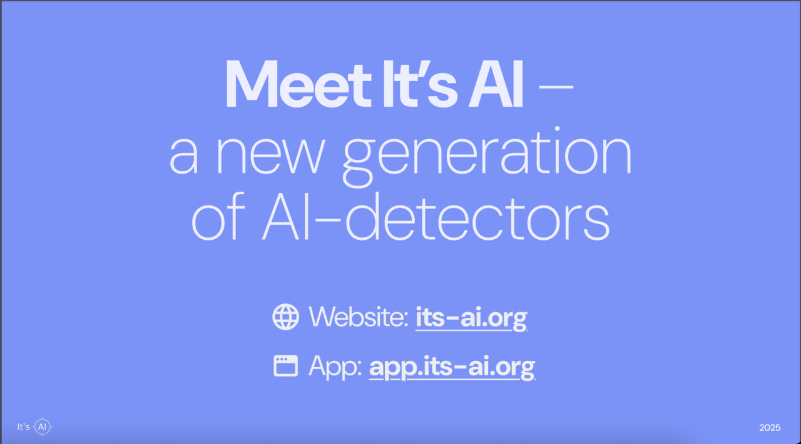

# **Bittensor SN32** <!-- omit in toc -->

 

---

## Decentralized AI Detection <!-- omit in toc -->  

### [🌐 Website](https://its-ai.org/)  
### [⛏️ Mining Docs](docs/mining.md)&nbsp;&nbsp;&nbsp;&nbsp;&nbsp;&nbsp;|&nbsp;&nbsp;&nbsp;&nbsp;&nbsp;&nbsp;[🧑‍🏫 Validating Docs](docs/validating.md)&nbsp;&nbsp;&nbsp;&nbsp;&nbsp;&nbsp;|&nbsp;&nbsp;&nbsp;&nbsp;&nbsp;&nbsp;[🎯Incentive mechanism](docs/incentive.md)
### [🤔 FAQ](docs/FAQ.md)   

# About

It's AI is an ai-detector tool, which helps people to identify whether the text was human-written or ai-generated. In addition to just classifying texts, It's AI also provides a deep scan functionality, which shows probabilities of AI for each sentence in the text.

While ChatGpt alone has more than 1.8 billion monthly visits, we believe that the ability to accurately determine AI-generated text is really important and will become even more demanded in the future.

## General
* Website: https://its-ai.org
* Twitter(X): https://x.com/ai_detection
* Accuracy report: https://its-ai.org/en/accuracy

## Key Highlights (TL;DR)
Here is a key highlights of It's AI, which will be fully covered further:
1) Most accurate ai-detector in the world according to MGTD benchmark (ICAIE, 2025)
2) More than just a subnet. We've have a fully operating ITSAI TECHNOLOGIES - FZCO and already generating revenue. More than 22k webiste visits in February.
3) Constantly improving. We've already developed website, web app, chrome extension, API, X bot and many more (find full description below). Try It's AI by yourself at https://its-ai.org.
4) High market potential. More than 3 billion dollars in market size in just English-speaking countries and we're going right for it. The real-world demand is evident, as demonstrated by our competitors: GptZero (50m$ valuation), CopyLeaks (4m$ last year revenue), ZeroGpt (10m monthly visits) and others.
5) Incentive mechanism. Time and benchmarks proven validation process that makes miners work in the right direction. Thanks to it we've become a new state-of-the-art solution on all three considered academia-known benchmarks.

## Key Highlights (Full)
### Most accurate AI detector
According to the MGTD benchmark [(ICAIE 2025)](https://publications.waset.org/10014332/towards-reliable-machine-generated-text-detection-a-unified-benchmarking-framework) – currently the largest and most robust public benchmark for AI detectors (15 datasets, ~2M samples) – It’s AI ranks **#1** with over **92% ROC-AUC**, ahead of detectors like GPTZero, Originality and CopyLeaks.

On the RAID benchmark [(ACL paper 2024)](https://arxiv.org/abs/2405.07940) we achieved **98.3% accuracy** on the official [leaderboard](https://raid-bench.xyz/leaderboard),  beating the biggest commercial competitor GPTZero on 8 out of 11 considered LLMs.

We also evaluated It's AI on GRiD, HC3 and GhostBuster datasets and reached on average **99.1% accuracy** and **96% F1-score**, becoming the new SOTA solution among the detectors covered in these works.

In education-related settings, It’s AI showed **0.8% false positive rate** on the ASAP 2.0 student essays dataset, and for Arabic-language benchmarks (ASJP, XL-SUM) achieved **98.7% accuracy** with **≤0.5% FPR**, demonstrating reliable performance beyond English.

You can find the full benchmarks report here: https://its-ai.org/en/accuracy

### ITSAI TECHNOLOGIES - FZCO
In the end of Jan 2025 we set up ITSAI TECHNOLOGIES - our company in Dubai.

We see It’s AI to be much more than just a subnet on bittensor and it’s a really big step in SN32 history on our way to 100m$+ valuation, which I believe is quite possible on the 5-year timeframe. By our measurements, the potential market size for our ai-detector is more than 3 billion dollars in just English-speaking countries and we’re going right for it. 

### Our Apps
Don't judge us by what we say, judge us by what we've done. Here is the list of things that we've already developed:
* Website (http://its-ai.org)
* App (http://app.its-ai.org). Try full experience in our app
* Chrome Extension (https://chromewebstore.google.com/detail/its-ai/lbjiajoblhodlkfloiphigkcemdonidn). Check your text instantly without leaving a page - just highlight it and get an answer
* API. Integrate It’s AI in your services with our API
* Zapier Integration. Connect AI detection with thousands of apps for automated workflows.
* Python SDK. Access It's AI detector right from the Python code
* Twitter bot - https://x.com/itsaibot. Verify content that you read instantly on X.

### Market size: TAM, SAM, SOM (US education segment only)
While there're several segment audience for AI detection, the biggest one of them is Education and below you can find our market analysis for US educational segment alone, where AI/plagiarism tools are already widely adopted. 

**TAM** (Total Addressable Market): ~4K universities, ~130K K–12 schools, ~20M higher-ed students; at ~$8–12/student/year for integrity tools that’s **$250–300M** (higher-ed + K–12 + adjacent). 

**SAM** (Serviceable Available Market): assuming ~50% of universities and ~10% of schools actively adopt such tools in 2025, we get **$120–150M**. 

**SOM** (Serviceable Obtainable Market): for a high-precision player like It’s AI, capturing 2–3% of SAM in 12–24 months implies **$3–5M ARR** potential in US education alone—before corporate or content-verification use cases. 

Globally, the AI-detector market is projected at **~$580M in 2025 → $2B+ by 2030**, so the same share yields a much larger opportunity over time. Full breakdown: [TAM, SAM, SOM explained (X)](https://x.com/ai_detection/status/1982089789361868906).

### Real world adoption
It's AI is already not just a technology - it's a market-ready product, which we're monetsing. In Feb 2026 we hit 1000+ organic daily visits on its-ai.org and 22k monthly visits - that's a 10x increase since November and we're keep growing fast.

We also looking for an Enterprise adoption - already running two pilots with private schools in UAE and planning to start recieving first Enterpise money since the new academic year.

### Incentive mechanism
For validation we continuously query miners with human-written and ai-generated texts, which were obtained with more than 30 different open-sourced LLMs from the top of LLM-arena. To make validation more robust we use different params for LLMs generation, alongside with augmentations and adversarial attacks.

For the time we're on bittensor, we've made incentive mechanism stable and effective, so that miners work in the right direction. The quality of our incenvtive mechanism is proven by academia-known benchmarks: we've became a new SOTA solution on all three considered datasets (RAID, GRiD, CUDRT).

If you want to dig deeper into incentive mechanism, check out [incentive doc](docs/incentive.md)  .

### Disclaimer
The tokens known as “Tao” or “Alpha Tao” associated with our subnet are not issued, sponsored, or endorsed by ITSAI TECHNOLOGIES - FZCO. These tokens are managed independently within the Bittensor ecosystem, and ITSAI TECHNOLOGIES - FZCO holds no responsibility or control over their issuance, distribution, or any related securities offerings.

ITSAI TECHNOLOGIES - FZCO is not engaged in any securities offerings, investment schemes, or similar financial arrangements associated with Tao or Alpha Tao tokens. By accessing or using our website, you acknowledge and agree that any participation in token-related activities is entirely separate from our business operations. We expressly disclaim any and all claims related to securities, investments, or financial returns that may be associated with these tokens.

Participation in any token-based or blockchain-related activities carries inherent risks. Users and investors are encouraged to conduct their own due diligence and seek independent financial or legal advice before engaging in such activities.
