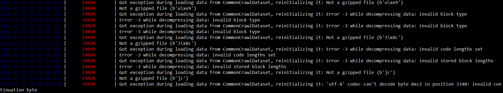

# FAQ

## Miners
### Do I need alphas to mine?
Yes, the minimum amount is 500 alphas per hotkey. 

Amount that you have for a hotkey will be calculated as a total amount of stake for the certain coldkey (distributed among its hotkeys or staked somewhere else) divided by the number of active mining hotkeys. If the amount on coldkey is not sufficient to cover all miners, we'll be sorting miner's active hotkeys by UID and then set zero weights for the last positions (until staked amount won't meed amount of active hotkeys).

### Is there a leaderboard where I can see the performance rankings of miners?
Yes, we do have a leaderboard based on OTF scores: https://huggingface.co/spaces/sergak0/ai-detection-leaderboard

### Do you have a wandb?
Yes, https://wandb.ai/itsai-dev/subnet32

### I deployed my miner, but it hasn't received any requests
It's okay to have no requests in first several hours - validators need some time see your miner.
If you already waited 2-3 hours and still has no queries, check that you've properly exposed your ports to the internet.

### The miner has been running for 9 hours, but taostats shows that emissions are still 0
If you get queries from validators than just wait for a several hours (around 5-6) and incentive should show up. 
If don't check question about not receiving requests.

### Import issues and errors inside installed python packages
If you see error and it's happening inside other library most probably you haven't install right version of it. 
Try to install correct packages from requirements.txt inside a new venv and rerun your miner.
Also we suggest you to use python 3.10 version.

### How can I evaluate the competitiveness of a model in this network without registration? Is there a local evaluator or something?
You can collect data in the way validator does using detection/data_generator.py and locally validate your model on it.
Other way is to run model on testnet and check it's scores in wandb.

### Does the baseline still valid for the miner?
Baseline model is not survivable, it may even not pass a minimum out_of_domain_f1_score (which was selected based on the current alive miners scores).

### Why am I getting zero scores from validators sometimes?
Here are some possible ways to get zero score:
a) answered to validator with wrong version
b) your miner answers on small batch texts don't match predictions on the same texts in big batch
c) mean f1-score on out of domain validation is less than 0.9
d) maybe there were an internet problem on your or validator side and you didn't recieve the request

### How can I improve quality of the model? What models should I use to be in the top?
It’s the goal of every miner to find out the way to be better and stay at the top. Even we don’t know which models are the best at the moment at your subnet. 

### Is testnet validator running?
Most probably yes - it should be running on SN87 on testnet.

### What is the maximum length of ai-check sentence?
350 words, words are defined as text.split()

## Validators

### The CommonCrawlDataset has rate limits and randomly stops working. Is there any alternative?

It's  working fine if you're not running several instances (of data generator or validators) at the same time, because it overwrites files in "cc_net/tmp_segments"

